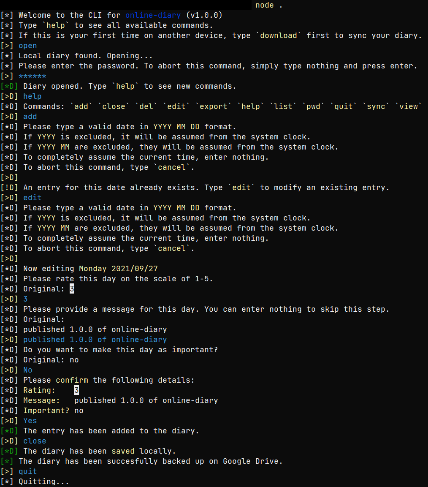
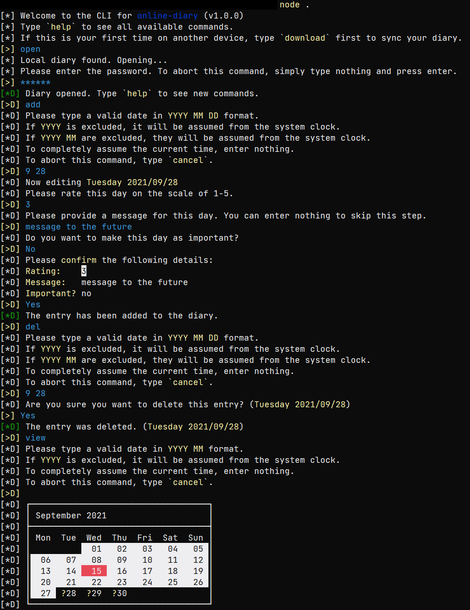

# node-js diary

This is a CLI app that lets you keep a digital diary.

## Features

- You can set a password to symetrically encrypt the diary file.
- You can set up integration with Google Drive to back up your diary on the cloud.
- You can export/import plain JSON files of the diary.
- You can set a rating for each day and set a custom message as well.

## Setup

You will need to have [Node.js](https://nodejs.org/en/download/) installed already.

1. Download as a zip and extract the files
2. Open a Powershell window in the downloaded folder and run `npm i` (or whatever equivalent on non-Windows platforms)
3. Run `node .` in the same terminal window to get started.

## Screenshots

